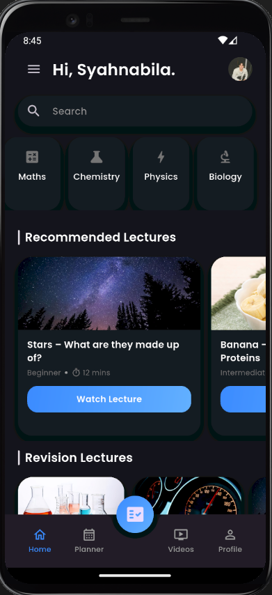
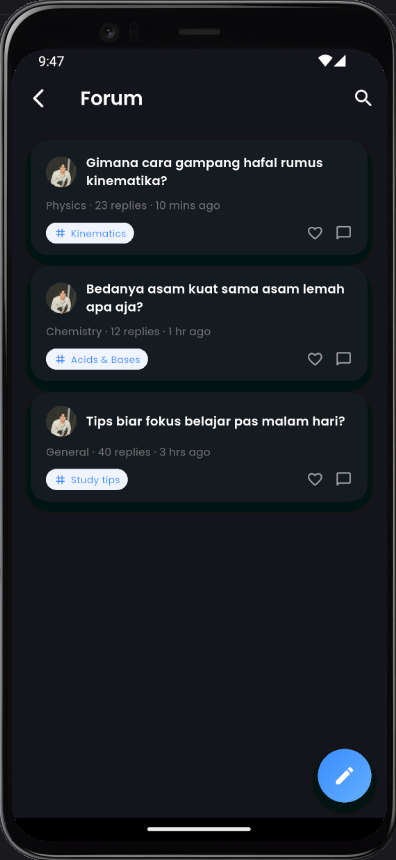
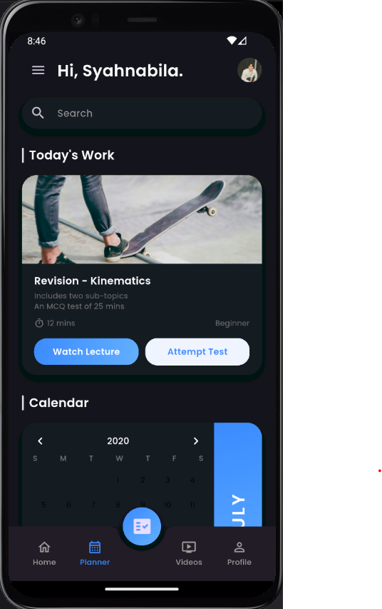
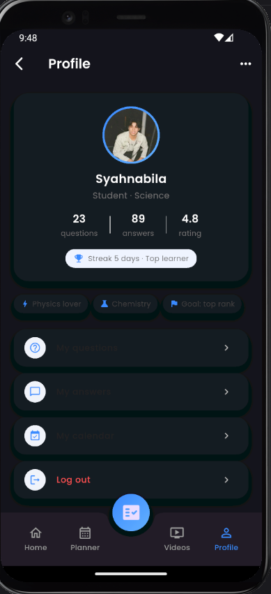
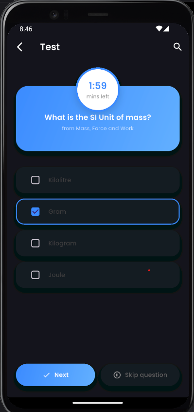
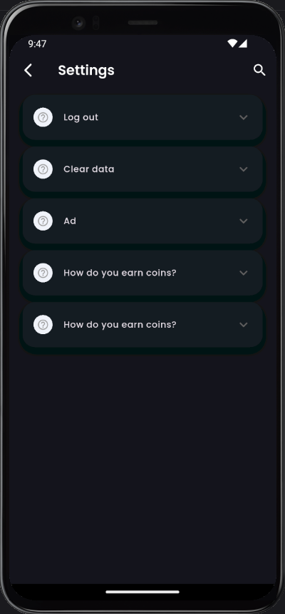
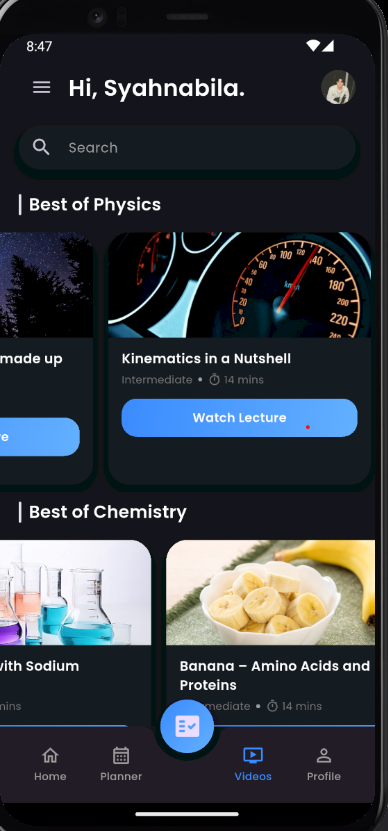
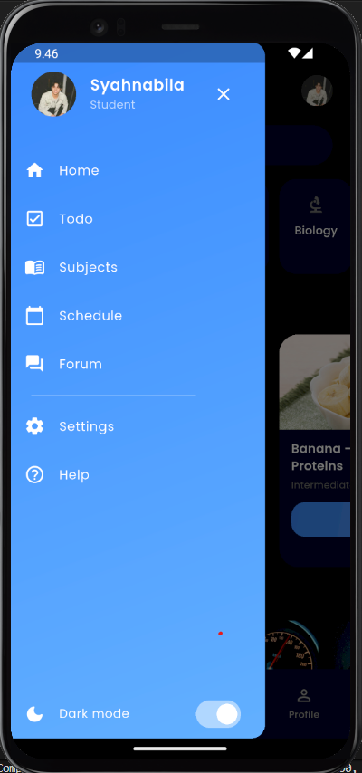

TUGAS UTS MEMBUAT APLIKASI FLUTTER (MINIMAL 5 LAYER)

NAMA MAHASISWA PEMBUAT : Syahnabila Oktaviani Hakim
NIM : 14022300098
MATA KULIAH : PEMROGRAMAN MOBILE
DOSEN PENGAMPU : Faisal Akhmad S.Kom., M.Kom.
PRODI SISTEM INFORMASI
FAKULTAS ILMU KOMPUTER UNIVERSITAS BINA BANGSA

---

## 1. Nama Aplikasi
Study App – Flutter Learning Dashboard

---

## 2. Deskripsi Singkat

Study App adalah aplikasi belajar berbasis Flutter yang meniru UI “learning dashboard”.  
Pengguna bisa melihat rekomendasi video pembelajaran, mengatur jadwal belajar, mengerjakan kuis singkat, dan memantau progres dari halaman profil. Aplikasi ini sudah mendukung **light mode** dan **dark mode** yang dapat diganti lewat drawer.

---

## 3. Fitur

1. 🏠 Home
- Header dengan sapaan: *“Hi, Syahnabila.”* dan foto profil.
- Kolom pencarian.
- Kartu subject (Maths, Chemistry, Physics, Biology).
- **Recommended Lectures**: kartu besar dengan gambar, level (Beginner/Intermediate), dan durasi.
- **Revision Lectures**: kartu kecil dengan gambar & info singkat materi.

2.  📅 Planner
- Bagian **Today’s Work** berisi kartu “Revision – Kinematics”:
  - Gambar ilustrasi (skateboard).
  - Deskripsi singkat dan durasi belajar.
  - Tombol aksi: **Watch Lecture** dan **Attempt Test**.
- Bagian **Calendar**:
  - Tampilan kalender bulan Juli dengan tanggal yang sedang dipilih.
  - Keterangan warna (legend) untuk Physics, Maths, dan Chemistry.

3. 🎬 Videos
- Section **Best of Physics**: list horizontal video fisika.
- Section **Best of Chemistry**: list horizontal video kimia.
- Setiap kartu video menampilkan gambar, judul, level, dan durasi + tombol **Watch Lecture**.

4. 👤 Profile
- Kartu profil dengan:
  - Foto profil dengan ring gradient.
  - Nama: **Syahnabila** dan status: *Student · Science*.
  - Statistik: jumlah **questions**, **answers**, dan **rating**.
  - Badge: *“Streak 5 days · Top learner”*.
- Deretan chip minat: *Physics lover*, *Chemistry*, *Goal: top rank*.
- Menu:
  - **My questions**
  - **My answers**
  - **My calendar**
  - **Log out**

5. 📝 Test / Quiz
- Diakses melalui Floating Action Button di tengah bottom bar.
- Header biru dengan lingkaran timer “1:59 mins left”.
- Pertanyaan: *“What is the SI Unit of mass?”*.
- List opsi jawaban (Kilolitre, Gram, Kilogram, Joule) dengan style pilihan yang jelas.
- Tombol bawah:
  - **Next**
  - **Skip question**

6. 🌗 Dark Mode
- Toggle **Dark mode** ada di **drawer** sebagai `Switch`.
- Mengubah:
  - Warna background (gelap).
  - Warna card & teks menyesuaikan tema.
  - Bottom bar dan seluruh halaman ikut berubah.

7. ☰ Drawer & Halaman Lain
- Drawer dengan gradient biru, berisi menu:
  - Home
  - Todo
  - Subjects
  - Schedule
  - Settings
  - Help
- Halaman **Help** dan **Settings** berisi list FAQ dengan `ExpansionTile` (buka/tutup jawaban).

---

## 4. Teknologi yang Digunakan

- Flutter (SDK UI cross-platform)
- Dart sebagai bahasa pemrograman
- Material Design (Widget Material: Scaffold, AppBar, 
  BottomNavigationBar, dll.)
- Paket google_fonts untuk font Poppins
- Navigator dan **MaterialPageRoute untuk pindah
  halaman
- Dark / Light Theme dengan `ThemeMode` dan kustom
  `ThemeData`

---

## 5. Cara Menjalankan

1. Clone repository
   ```bash
   git clone https://github.com/[Dico19]/[Study-App-Flutter-Learning-Dashboard].git
   cd [Study-App-Flutter-Learning-Dashboard]
2. Install dependency Flutter
   flutter pub get
3. Jalankan aplikasi di emulator / device
   flutter run
4. Pastikan:
   - flutter SDK sudah terinstall.
   - Device/emulator sudah terhubung (flutter devices).

---

## 6. Screenshot Halaman Utama










---

## 7. Commit Message
feat: add quiz screen and dark mode toggle
